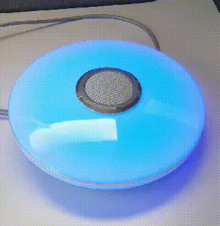

# Tool to control a LED ceiling light via bluetooth low energy

The [LED light](https://www.amazon.de/dp/B08ZXNG9BS) has LEDs for
RGB, Cold and Warm light as well a speaker.

The following features can be controlled via BLE:

- color temperature for white light
- brightness
- RGB color
- scenes
- volume
- equalizer
